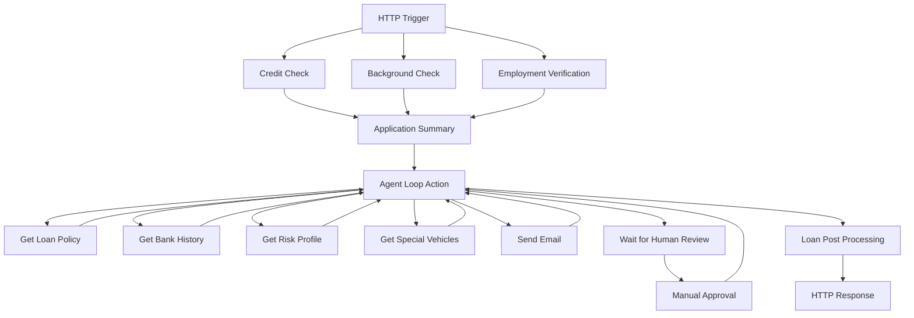

# AI Loan Agent

An AI-powered loan approval system that automates the evaluation of vehicle loan applications using Azure Logic Apps Standard and Azure OpenAI. The agent autonomously analyzes loan applications, calls verification tools, evaluates risk, and makes approval decisions or escalates complex cases to human reviewers.

**[Watch Demo Video](https://youtu.be/rR1QjQTfCCg)** | **[Agent Workflow Blog](https://techcommunity.microsoft.com/blog/integrationsonazureblog/%F0%9F%A4%96-agent-loop-demos-%F0%9F%A4%96/4414770)**

---

## Deploy

**Prerequisites:**
- Azure subscription with contributor access
- Region supporting Azure OpenAI (GPT-4.1-mini) and Logic Apps Standard - see [region selection](#region-selection)

**Deploy to your Azure subscription:**

[](https://portal.azure.com/#create/Microsoft.Template/uri/https%3A%2F%2Fraw.githubusercontent.com%2FAzure%2Flogicapps-labs%2Fmain%2Fsamples%2Fai-loan-agent-sample%2FDeployment%2Fsample-arm.json)

<details>
<summary><b>What happens when you deploy</b></summary>

1. Opens Azure Portal and prompts for subscription, [resource group](https://learn.microsoft.com/azure/azure-resource-manager/management/manage-resource-groups-portal) (create new recommended: `rg-ailoan`)
2. Provisions Azure resources (Logic App, OpenAI, Storage, App Service Plan, Managed Identity)
3. Configures [RBAC (Role-Based Access Control)](https://learn.microsoft.com/azure/role-based-access-control/overview) permissions for passwordless authentication
4. Deploys AI agent workflows with built-in test scenarios

</details>

<details>
<summary><b>What gets deployed</b></summary>

| Resource | Purpose |
|----------|----------|
| Logic App Standard | Hosts AI agent workflows |
| Azure OpenAI | GPT-4.1-mini model for agent reasoning |
| Storage Account | Workflow state and run history |
| App Service Plan | Compute resources |
| Managed Identity | Passwordless authentication |

See [Deployment automation](#learn-more) and [Sample data approach](#learn-more) for technical details.

</details>

<details id="region-selection">
<summary><b>Region selection</b></summary>

Recommended regions: East US 2, West Europe, Italy North, Australia East

See regional availability:
- [Azure OpenAI models](https://learn.microsoft.com/azure/ai-services/openai/concepts/models#model-summary-table-and-region-availability)
- [Logic Apps Standard](https://azure.microsoft.com/explore/global-infrastructure/products-by-region/)

</details>

<details>
<summary><b>Resource naming</b></summary>

Resources use `{projectName}` for subscription-scoped resources and `{projectName}{uniqueId}` for globally-unique resources:

| Resource | Example (projectName = "ailoan") |
|----------|----------------------------------|
| Resource Group | `rg-ailoan` |
| Logic App | `ailoanxyz123-logicapp` |
| Azure OpenAI | `ailoan-openai` |
| Storage Account | `ailoanxyz123` |

</details>

---

## Explore

After deployment, test the agent with different loan scenarios to see how it autonomously makes decisions.

### Run a test

1. Open [Azure Portal](https://portal.azure.com) > your resource group > Logic App > **Workflows** > **LoanApprovalAgent** > [**Run history**](https://learn.microsoft.com/azure/logic-apps/monitor-logic-apps#review-runs-history)

   

2. Click **Run** > [**Run with payload**](https://learn.microsoft.com/azure/logic-apps/test-logic-apps-track-results#run-with-payload)
3. Paste one of the test payloads below and select **Run**. Wait a few seconds for the workflow to finish; on the **Output** tab you’ll see `Status Code: 200` and the agent’s decision message in the response body.
4. (Optional) Select to open the monitoring view if you want to inspect the workflow execution in detail. The monitoring view shows action inputs/outputs, agent token usage per iteration, and agent tool calls in the **Agent log** tab (for example, **Send Customer Email**).

   


**Test these scenarios to see different decision paths:**

<details>
<summary><b>Test scenario 1: Auto-approval</b></summary>

Strong credit, modest loan amount:

```json
{"applicationId":"APP-AUTO-APPROVE-001","name":"Applicant A","email":"applicant.a@example.com","loanAmount":25000,"vehicleMake":"Toyota","vehicleModel":"Camry","salary":75000,"employmentYears":5}
```

**Expected result:** Response body confirms approval with loan amount; `decision` = `"APPROVED"`.

</details>

<details>
<summary><b>Test scenario 2: Edge case</b></summary>

High loan amount, strong financial profile:

```json
{"applicationId":"APP-REVIEW-REQUIRED-002","name":"Applicant B","email":"applicant.b@example.com","loanAmount":55000,"vehicleMake":"BMW","vehicleModel":"X5","salary":95000,"employmentYears":3}
```

**Expected result:** Edge case. Response body may explain the request is under human review (loan amount > limit, higher risk, luxury vehicle). `decision` most often `"PENDING"`, but approvals/declines are possible.

</details>

<details>
<summary><b>Test scenario 3: Auto-rejection</b></summary>

Weak credit score, bankruptcy history:

```json
{"applicationId":"APP-AUTO-REJECT-003","name":"Applicant C","email":"applicant.c@example.com","loanAmount":30000,"vehicleMake":"Honda","vehicleModel":"Accord","salary":45000,"employmentYears":0.5}
```

**Expected result:** Response body states the application was declined for low credit, short employment history, and bankruptcy history; `decision` = `"REJECTED"`.

</details>

<details>
<summary><b>Test scenario 4: Human escalation</b></summary>

Luxury vehicle requiring additional review:

```json
{"applicationId":"APP-LUXURY-REVIEW-004","name":"Applicant D","email":"applicant.d@example.com","loanAmount":80000,"vehicleMake":"Ferrari","vehicleModel":"F8 Tributo","salary":120000,"employmentYears":4}
```

**Expected result:** Response body confirms approval after review with loan amount; `decision` = `"APPROVED"`. Monitoring view shows "Get special vehicles" and "Wait for Human Review" before completion.

</details>

**Tips:** 
- Review **Agent log** tab to see which tools the agent called
- Check **Metadata** tab (under Loan Agent action) for token usage statistics
- Runs complete in 5-15 seconds
- [Learn more about reviewing agent execution](https://learn.microsoft.com/azure/logic-apps/create-autonomous-agent-workflows#review-tool-execution-data)

---

## Extend

This sample uses built-in test data to eliminate external dependencies. Here's how to extend it for production use:

### Replace demo services

**Ready to add human-in-the-loop approval?** Follow [**TEAMS-CONNECTOR.md**](TEAMS-CONNECTOR.md) to integrate Microsoft Teams Adaptive Cards for real approvals.

| Component | Demo Implementation | Production Options |
|-----------|----------------------|-------------------|
| Human Review | Built-in approval logic | Microsoft Teams Adaptive Cards, ServiceNow, Jira |
| Email Notifications | Template responses | Office 365 Outlook, SendGrid, Azure Communication Services |
| Credit Checks | Simulated credit scores | Experian, TransUnion, Equifax APIs |
| Background Checks | Test data | Checkr, GoodHire, Sterling APIs |
| Banking History | Static scenario data | SQL Database, Cosmos DB, Banking APIs, Plaid |
| Vehicle Valuation | Static luxury list | Kelly Blue Book, NADA, Edmunds, Black Book APIs |

### Customize workflows

**Option 1: Edit in Azure Portal**
- Navigate to your Logic App > Workflows > select workflow > **Edit**
- Use the visual designer to modify workflow logic
- [Learn more about editing workflows in Azure Portal](https://learn.microsoft.com/azure/logic-apps/create-single-tenant-workflows-azure-portal)

**Option 2: Edit in VS Code**
- Follow setup instructions in [`LogicApps/README.md`](LogicApps/README.md)
- Edit workflow JSON files locally
- Deploy changes using Azure Logic Apps VS Code extension

---

## Workflows

Five workflows process loan applications using autonomous AI decision-making:

<details>
<summary><b>Workflow details</b></summary>


### LoanApprovalAgent

Orchestrates loan approval using an AI agent. The agent evaluates applications against business rules, autonomously selecting and sequencing tools.

**Agent Tools:**
- Get loan approval policy - Retrieves approval/rejection criteria
- Get customer bank history - Fetches customer banking records
- Get applicant risk profile - Evaluates financial risk
- Get special vehicles - Checks for luxury vehicle requirements
- Send customer email - Sends approval/rejection notification
- Wait for human review - Escalates to human approver when needed

**Process Flow:**



### GetCustomerHistory

Retrieves simulated customer banking history including balance, transaction patterns, and debt-to-income ratio. In production, this would integrate with banking APIs.

### GetRiskProfile

Evaluates applicant risk based on loan amount, annual salary, employment years, credit score, and bankruptcy history. Returns a comprehensive risk assessment.

### GetSpecialVehicles

Checks if the requested vehicle is classified as a luxury or high-value vehicle that requires additional approval steps. Uses a reference list for demonstration.

### LoanPostProcessing

Handles post-decision workflows such as logging, analytics, and integration with external systems. Currently a placeholder for extending the sample.

</details>

<details>
<summary><b>Required Connections</b></summary>

This sample uses Azure OpenAI with Managed Identity authentication for passwordless access.

| Connection Name | Connector Name | Connector Type | Purpose |
|-----------------|----------------|----------------|---------|
| Azure OpenAI Connection | Azure OpenAI | Agent | Powers the AI agent decision-making in LoanApprovalAgent workflow |

**Authentication:** System-Assigned Managed Identity with `Cognitive Services OpenAI User` role assigned to Azure OpenAI resource during deployment.

</details>

---

## Learn more

<details>
<summary><b>Troubleshooting</b></summary>

| Issue | Solution |
|-------|----------|
| **CustomDomainInUse** | Use different project name. [Purge deleted resources](https://learn.microsoft.com/azure/ai-services/recover-purge-resources) if needed. |
| **InsufficientQuota** | Try different [region](#region-selection) or [request quota increase](https://learn.microsoft.com/azure/ai-services/openai/how-to/quota). |
| **Deployment timeout** | Allow 15 min. [View Activity Log](https://learn.microsoft.com/azure/azure-monitor/essentials/activity-log). Redeploy: resource group > Deployments > select > Redeploy. |
| **Unauthorized** | Wait 2-3 min for RBAC propagation. [Verify role assignments](https://learn.microsoft.com/azure/logic-apps/authenticate-with-managed-identity?tabs=standard). |
| **ajaxExtended call failed** | Designer: rename trigger "manual" → "manual2" > save > rename back > save. [Details](https://learn.microsoft.com/answers/questions/2046895). |
| **Run stuck** | Wait 1-2 min, refresh. Check run history for errors. Verify model is active. |

</details>

<details>
<summary><b>Deployment automation</b></summary>

The Deploy to Azure button uses a two-stage process:

**Build** (manual via [`BundleAssets.ps1`](1ClickDeploy/BundleAssets.ps1)):
- Compiles [Bicep modules](Deployment/infrastructure/) → [`sample-arm.json`](1ClickDeploy/sample-arm.json)
- Bundles [workflow definitions](LogicApps/) → [`workflows.zip`](1ClickDeploy/workflows.zip)

**Deploy** (automated):
- [ARM (Azure Resource Manager)](https://learn.microsoft.com/azure/azure-resource-manager/templates/overview) template provisions Azure resources
- Embedded deployment script configures RBAC and deploys workflows

[Learn about ARM deployment scripts](https://learn.microsoft.com/azure/azure-resource-manager/bicep/deployment-script-bicep)

</details>

<details>
<summary><b>Sample data approach</b></summary>

This sample uses built-in test data to simplify exploration:
- **Credit/Background checks:** `Compose` actions with test data
- **Human approval:** Conditional logic (no Teams integration)
- **Vehicle database:** Static reference list

For production integration options, see [Extend](#extend).

</details>

<details>
<summary><b>Resources</b></summary>

**Agent workflows:** [Create autonomous agents](https://learn.microsoft.com/azure/logic-apps/create-autonomous-agent-workflows) | [Best practices](https://learn.microsoft.com/azure/logic-apps/create-autonomous-agent-workflows#best-practices-for-agents-and-tools)

**Azure OpenAI:** [System messages](https://learn.microsoft.com/azure/ai-services/openai/concepts/system-message) | [Managed Identity](https://learn.microsoft.com/azure/logic-apps/authenticate-with-managed-identity)

</details>
