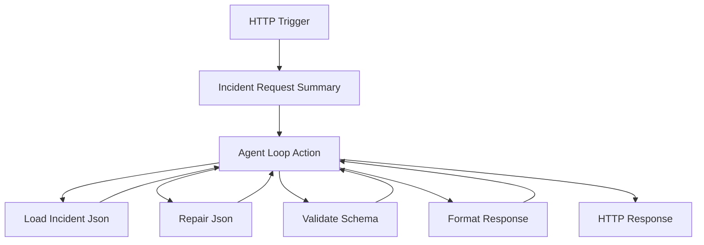

# JSON Remediation Agent

An autonomous operations agent that repairs malformed JSON records, applies deterministic schema corrections, validates structure, and outputs clean, ingestion-ready payloads—entirely deterministic with no external service dependencies.

**[Watch Demo Video](https://youtu.be/uciB7jtDpyk)** | **[Agent Workflow Blog](https://techcommunity.microsoft.com/blog/integrationsonazureblog/%F0%9F%A4%96-agent-loop-demos-%F0%9F%A4%96/4414770)**

---

## Deploy

**Prerequisites:**
- Azure subscription with contributor access
- Region supporting Azure OpenAI (gpt-4o-mini) and Logic Apps Standard - see [region selection](#region-selection)

**Deploy to your Azure subscription:**

[](https://portal.azure.com/#create/Microsoft.Template/uri/https%3A%2F%2Fraw.githubusercontent.com%2FAzure%2Flogicapps-labs%2Fmain%2Fsamples%2Fjson-remediation-agent%2FDeployment%2Fsample-arm.json)

<details>
<summary><b>What happens when you deploy</b></summary>

1. Opens Azure Portal and prompts for subscription, [resource group](https://learn.microsoft.com/azure/azure-resource-manager/management/manage-resource-groups-portal) (create new recommended: `rg-jsonremediation`)
2. Provisions Azure resources (Logic App, OpenAI, Storage, App Service Plan, Managed Identity)
3. Configures [RBAC (Role-Based Access Control)](https://learn.microsoft.com/azure/role-based-access-control/overview) permissions for passwordless authentication
4. Deploys autonomous agent workflows with built-in test data for immediate testing

</details>

<details>
<summary><b>What gets deployed</b></summary>

| Resource | Purpose |
|----------|---------|
| Logic App Standard | Hosts autonomous agent workflows |
| Azure OpenAI | gpt-4o-mini model for agent reasoning |
| Storage Account | Workflow state and run history |
| App Service Plan | Compute resources |
| Managed Identity | Passwordless authentication |

See [Deployment automation](#learn-more) and [Sample data approach](#learn-more) for technical details.

</details>

<details id="region-selection">
<summary><b>Region selection</b></summary>

Recommended regions: East US 2, West Europe, Sweden Central, Australia East

See regional availability:
- [Azure OpenAI models](https://learn.microsoft.com/azure/ai-services/openai/concepts/models#model-summary-table-and-region-availability)
- [Logic Apps Standard](https://azure.microsoft.com/explore/global-infrastructure/products-by-region/)

</details>

<details>
<summary><b>Resource naming</b></summary>

Resources use `{projectName}` for subscription-scoped resources and `{projectName}{uniqueId}` for globally-unique resources:

| Resource | Example (projectName = "jsonops") |
|----------|-----------------------------------|
| Resource Group | `rg-jsonops` |
| Logic App | `jsonopsxyz123-logicapp` |
| Azure OpenAI | `jsonops-openai` |
| Storage Account | `jsonopsxyz123` |

</details>

---

## Explore

After deployment, test the agent with different malformed JSON scenarios to see how it autonomously repairs and validates data.

### Run a test

1. Open [Azure Portal](https://portal.azure.com) > your resource group > Logic App > **Workflows** > **JsonRemediationAgent** > [**Run history**](https://learn.microsoft.com/azure/logic-apps/monitor-logic-apps#review-runs-history)

2. Click **Run** > **Run with payload**

3. Paste one of the test payloads below and select **Run**. Wait a few seconds for the workflow to finish; on the **Output** tab you'll see `Status Code: 200` and the agent's repair summary in the response body.

4. (Optional) Select to open the monitoring view if you want to inspect the workflow execution in detail. The monitoring view shows action inputs/outputs and agent tool calls in the **Agent log** tab (e.g., **LoadIncidentJson**, **RepairJson**).

**Test these scenarios to see different repair strategies:**

<details>
<summary><b>Scenario 1: Missing required field</b></summary>

Missing `customerId` field:

```json
{"caseId":"incident-missing-field"}
```

**Expected result:** Agent outputs:
```
CASE ID: incident-missing-field
STATUS: SUCCESS
CHANGES APPLIED:
- Added missing field 'customerId' with value 'UNKNOWN'
VALIDATION: PASSED
REPAIRED JSON:
{"incidentId":"INC-9001","customerId":"UNKNOWN","priority":3,"details":{"description":"System outage"}}
```

</details>

<details>
<summary><b>Scenario 2: Type mismatches</b></summary>

Priority as string number, nested field with wrong type:

```json
{"caseId":"incident-wrong-type"}
```

**Expected result:** Agent outputs:
```
CASE ID: incident-wrong-type
STATUS: SUCCESS
CHANGES APPLIED:
- Converted priority from string "2" to integer 2
VALIDATION: PASSED
```

</details>

<details>
<summary><b>Scenario 3: Field standardization</b></summary>

Non-canonical field names (`id`, `prio`, `cust_id`, `desc`):

```json
{"caseId":"incident-field-standardization"}
```

**Expected result:** Agent outputs:
```
CASE ID: incident-field-standardization
STATUS: SUCCESS
CHANGES APPLIED:
- Normalized field 'cust_id' to 'customerId'
- Normalized field 'prio' to 'priority'
- Normalized field 'details.desc' to 'details.description'
VALIDATION: PASSED
```

</details>

<details>
<summary><b>Scenario 4: Null object handling</b></summary>

Null details object:

```json
{"caseId":"incident-partial-object"}
```

**Expected result:** Agent outputs:
```
CASE ID: incident-partial-object
STATUS: SUCCESS
CHANGES APPLIED:
- Replaced null details with {description: 'No details provided'}
VALIDATION: PASSED
```

</details>

**Tips:**
- Review **Agent log** tab to see which tools the agent called
- Check **Metadata** tab for token usage statistics
- Runs complete in 5-15 seconds
- [Learn more about reviewing agent execution](https://learn.microsoft.com/azure/logic-apps/create-autonomous-agent-workflows#review-tool-execution-data)

---

## Extend

This sample includes preconfigured test data in the `LogicApps/data/` folder that deploys with the workflow package to your Logic App instance. This data is **ephemeral and resets on every deployment**—it is not intended for production use. Implementations should replace these demo components with persistent connectors and services.

### Replace demo components

| Component | Demo Implementation | Production Options |
|-----------|----------------------|-------------------|
| Incident Data Source | Embedded JSON files in workflow logic (no persistent `/data/incidents/` folder) | Azure Blob Storage (trigger on new blob), Cosmos DB (query by status), Event Grid (subscribe to events), Service Bus (process queue messages) |
| Schema Management | Embedded schema reference | Azure App Configuration, Blob Storage with versioning, Schema Registry with multi-tenant support |
| Output Destination | Response-only (no persistence) | Azure Blob Storage (partitioned writes), Azure Queue (downstream processing), Event Hub (real-time analytics), Cosmos DB (indexed storage) |
| Validation | Built-in JavaScript checks | Azure Data Factory validation, JSON Schema validators, custom validation APIs |

### Customize workflows

**Option 1: Edit in Azure Portal**
- Navigate to your Logic App > Workflows > select workflow > **Edit**
- Use the visual designer to modify workflow logic
- [Learn more about editing workflows in Azure Portal](https://learn.microsoft.com/azure/logic-apps/create-single-tenant-workflows-azure-portal)

**Option 2: Edit in VS Code**
- Install [Azure Logic Apps (Standard) extension](https://marketplace.visualstudio.com/items?itemName=ms-azuretools.vscode-azurelogicapps)
- In VS Code, select the Azure icon on the Activity Bar
- Under **Resources**, expand your subscription and find your deployed Logic App
- Expand **Workflows**, right-click a workflow, and select **Open Designer** to view/edit
- [Learn more about editing workflows in VS Code](https://learn.microsoft.com/azure/logic-apps/manage-logic-apps-visual-studio-code)

---

## Workflows

Three workflows process malformed JSON using autonomous AI decision-making:

<details>
<summary><b>Workflow details</b></summary>

### JsonRemediationAgent

Orchestrates JSON remediation using an AI agent. The agent evaluates malformed data, autonomously selecting and sequencing repair tools.

**Agent Tools:**
- **LoadIncidentJson** - Reads malformed JSON from app content folder with error handling
- **RepairJson** - Applies deterministic transformations (add fields, fix types, rename, normalize)
- **ValidateSchema** - Validates against incident.schema.json
- **FormatResponse** - Formats completion summary for the response

**Process Flow:**



### JsonRepairEngine (Nested)

Applies deterministic transformations to malformed JSON:
- Adds required fields with defaults (e.g., `customerId: "UNKNOWN"`)
- Fixes type mismatches (string numbers → integers)
- Renames non-canonical fields (`prio` → `priority`, `cust_id` → `customerId`)
- Initializes null objects with default structures
- Returns repaired JSON and array of changes made

### SchemaValidator (Nested)

Validates JSON against schema definition:
- Checks all required fields exist (`incidentId`, `priority`, `customerId`, `details`)
- Validates field types (string, number, object)
- Verifies nested object requirements (`details.description`)
- Returns `isValid` boolean and array of violations

</details>

<details>
<summary><b>Required Connections</b></summary>

This sample uses Azure OpenAI with Managed Identity authentication for passwordless access.

| Connection Name | Connector Name | Connector Type | Purpose |
|-----------------|----------------|----------------|---------|
| Azure OpenAI Connection | Azure OpenAI | Agent | Powers the AI agent decision-making in JsonRemediationAgent workflow |

**Authentication:** System-Assigned Managed Identity with `Cognitive Services OpenAI User` role assigned to Azure OpenAI resource during deployment.

</details>

---

## Learn more

<details>
<summary><b>Troubleshooting</b></summary>

| Issue | Solution |
|-------|----------|
| **CustomDomainInUse** | Use different project name. [Purge deleted resources](https://learn.microsoft.com/azure/ai-services/recover-purge-resources) if needed. |
| **InsufficientQuota** | Try different [region](#region-selection) or [request quota increase](https://learn.microsoft.com/azure/ai-services/openai/how-to/quota). |
| **Deployment timeout** | Allow 15 min. [View Activity Log](https://learn.microsoft.com/azure/azure-monitor/essentials/activity-log). Redeploy: resource group > Deployments > select > Redeploy. |
| **Unauthorized** | Wait 2-3 min for RBAC propagation. [Verify role assignments](https://learn.microsoft.com/azure/logic-apps/authenticate-with-managed-identity?tabs=standard). |
| **ajaxExtended call failed** | Designer: rename trigger "manual" → "manual2" > save > rename back > save. [Details](https://learn.microsoft.com/answers/questions/2046895). |
| **JSON parse failed** | LoadIncidentJson handles broken JSON automatically. If syntax is too corrupted, check violations array in response. |
| **Schema validation fails** | Check `violations[]` in response body. Common: missing fields, type mismatches, null objects. Enhance RepairJson transforms. |
| **Outbox files not found** | `/data/outbox/` is ephemeral (overwritten on redeploy). For production, use Azure Blob Storage. |
| **Agent loop timeout** | Increase limit count in AgentLoop action or simplify repair logic. Check Agent log for stuck tools. |
| **Run stuck** | Wait 1-2 min, refresh. Check run history for errors. Verify model is active. |

</details>

<details id="deployment-automation">
<summary><b>Deployment automation</b></summary>

The Deploy to Azure button uses a two-stage process:

**Build** (manual via [`BundleAssets.ps1`](../shared/scripts/BundleAssets.ps1)):
- Compiles [Bicep modules](../shared/modules/) → [`sample-arm.json`](Deployment/sample-arm.json)
- Bundles [workflow definitions](LogicApps/) → [`workflows.zip`](Deployment/workflows.zip)

**Deploy** (automated):
- [ARM (Azure Resource Manager)](https://learn.microsoft.com/azure/azure-resource-manager/templates/overview) template provisions Azure resources
- Embedded deployment script configures RBAC and deploys workflows

[Learn about ARM deployment scripts](https://learn.microsoft.com/azure/azure-resource-manager/bicep/deployment-script-bicep)

</details>

<details id="sample-data-approach">
<summary><b>Sample data approach</b></summary>

This sample uses built-in test data embedded in the workflow package to simplify exploration:
- **Incident files**: 5 malformed JSON files in `LogicApps/data/incidents/`
- **Schema definition**: `LogicApps/data/schema/incident.schema.json`
- **Outbox**: Simulated write to `LogicApps/data/outbox/` (ephemeral)

**Data folder location**: `LogicApps/data/` is packaged with workflows.zip and deployed to the Logic App's application content folder. This folder is **overwritten on every deployment** and should not be used for durable storage in production.

For production integration options, see [Extend](#extend).

</details>

<details>
<summary><b>Resources</b></summary>

**Agent workflows:** [Create autonomous agents](https://learn.microsoft.com/azure/logic-apps/create-autonomous-agent-workflows) | [Best practices](https://learn.microsoft.com/azure/logic-apps/create-autonomous-agent-workflows#best-practices-for-agents-and-tools)

**Azure OpenAI:** [System messages](https://learn.microsoft.com/azure/ai-services/openai/concepts/system-message) | [Managed Identity](https://learn.microsoft.com/azure/logic-apps/authenticate-with-managed-identity)

</details>
