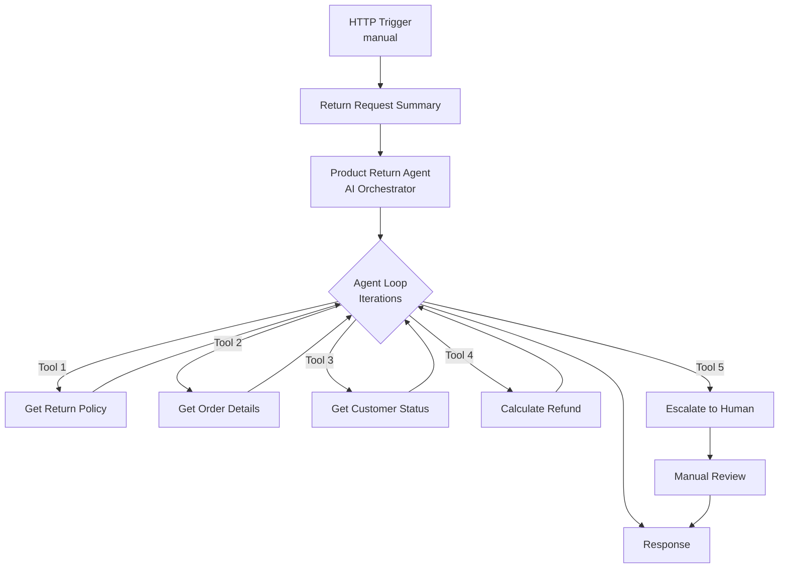

# AI Product Return Agent

An AI-powered product return system that automates the evaluation of return requests using Azure Logic Apps Standard and Azure OpenAI. The agent autonomously analyzes return requests, validates policies, checks order details, evaluates customer status, calculates refunds, and makes approval decisions or escalates complex cases to human reviewers.

**[Watch Demo Video](https://youtu.be/ilSGRUpjMdU)**

---

## Deploy

**Prerequisites:**
- Azure subscription with contributor access
- Region supporting Azure OpenAI (GPT-4o-mini) and Logic Apps Standard - see [region selection](#region-selection)

**Deploy to your Azure subscription:**

[](https://portal.azure.com/#create/Microsoft.Template/uri/https%3A%2F%2Fraw.githubusercontent.com%2FAzure%2Flogicapps-labs%2Fmain%2Fsamples%2Fproduct-return-agent-sample%2FDeployment%2Fsample-arm.json)

<details>
<summary><b>What happens when you deploy</b></summary>

1. Opens Azure Portal and prompts for subscription, [resource group](https://learn.microsoft.com/azure/azure-resource-manager/management/manage-resource-groups-portal) (create new recommended: `rg-productreturn`)
2. Provisions Azure resources (Logic App, OpenAI, Storage, App Service Plan, Managed Identity)
3. Configures [RBAC (Role-Based Access Control)](https://learn.microsoft.com/azure/role-based-access-control/overview) permissions for passwordless authentication
4. Deploys AI agent workflows with built-in test scenarios

</details>

<details>
<summary><b>What gets deployed</b></summary>

| Resource | Purpose |
|----------|----------|
| Logic App Standard | Hosts AI agent workflows |
| Azure OpenAI | GPT-4o-mini model for agent reasoning |
| Storage Account | Workflow state and run history |
| App Service Plan | Compute resources |
| Managed Identity | Passwordless authentication |

See [Deployment automation](#learn-more) and [Sample data approach](#learn-more) for technical details.

</details>

<details id="region-selection">
<summary><b>Region selection</b></summary>

Recommended regions: East US 2, West Europe, Sweden Central, North Central US

See regional availability:
- [Azure OpenAI models](https://learn.microsoft.com/azure/ai-services/openai/concepts/models#model-summary-table-and-region-availability)
- [Logic Apps Standard](https://azure.microsoft.com/explore/global-infrastructure/products-by-region/)

</details>

<details>
<summary><b>Resource naming</b></summary>

Resources use `{projectName}` for subscription-scoped resources and `{projectName}{uniqueId}` for globally-unique resources:

| Resource | Example (projectName = "productreturn") |
|----------|----------------------------------|
| Resource Group | `rg-productreturn` |
| Logic App | `productreturnxyz123-logicapp` |
| Azure OpenAI | `productreturn-openai` |
| Storage Account | `productreturnxyz123` |

</details>

---

## Explore

After deployment, test the agent with different return scenarios to see how it autonomously makes decisions.

### Run a test

1. Open [Azure Portal](https://portal.azure.com) > your resource group > Logic App > **Workflows** > **ProductReturnAgent** > [**Run history**](https://learn.microsoft.com/azure/logic-apps/monitor-logic-apps#review-runs-history)
2. Click **Run** > [**Run with payload**](https://learn.microsoft.com/azure/logic-apps/test-logic-apps-track-results#run-with-payload)
3. Paste one of the test payloads below > **Run** (returns success)
4. Click **Refresh** > click the **Identifier** to open monitoring view
5. In **Agent log** tab, review which tools the agent called
6. In workflow, click **Product Return Agent** action > **Outputs** tab > verify `decision` and `refundAmount` fields

**Test these scenarios to see different decision paths:**

<details>
<summary><b>Test scenario 1: Defective item - Auto-approval</b></summary>

Coffee maker reported as defective, within return window:

```json
{"orderId":"ORD001","customerId":"CUST001","reason":"defective","description":"Coffee maker stopped working after 10 days","imageData":"https://example.com/images/ORD001-product.jpg"}
```

**Expected result:** `decision` = `"APPROVED"` with `refundAmount` = `150` in Product Return Agent action outputs, full refund for defective item

</details>

<details>
<summary><b>Test scenario 2: Opened perishable - Auto-rejection</b></summary>

Opened coffee beans, perishable item:

```json
{"orderId":"ORD002","customerId":"CUST002","reason":"changed_mind","description":"Don't like the flavor","imageData":"https://example.com/images/ORD002-product.jpg"}
```

**Expected result:** `decision` = `"REJECTED"` with `refundAmount` = `0` in Product Return Agent action outputs, perishable items cannot be returned once opened

</details>

<details>
<summary><b>Test scenario 3: Order not found - Auto-rejection</b></summary>

Order doesn't exist in system:

```json
{"orderId":"ORD005","customerId":"CUST004","reason":"changed_mind","description":"Want to return this item","imageData":"https://example.com/images/ORD005-product.jpg"}
```

**Expected result:** `decision` = `"REJECTED"` with `refundAmount` = `0` in Product Return Agent action outputs, order not found

</details>

<details>
<summary><b>Test scenario 4: High-value fraud risk - Escalation</b></summary>

Premium customer with excessive return history, expensive item:

```json
{"orderId":"ORD003","customerId":"CUST003","reason":"changed_mind","description":"Decided to get a different model","imageData":"https://example.com/images/ORD003-product.jpg"}
```

**Expected result:** `decision` = `"ESCALATED"` with `refundAmount` = `0` in Product Return Agent action outputs. Agent log shows "Escalate_to_human" tool call for manual review.

</details>

<details>
<summary><b>Test scenario 5: Opened electronics - Approved with fee</b></summary>

Opened electronics with restocking fee:

```json
{"orderId":"ORD004","customerId":"CUST001","reason":"changed_mind","description":"Found a better price elsewhere","imageData":"https://example.com/images/ORD004-opened.jpg"}
```

**Expected result:** `decision` = `"APPROVED"` with `refundAmount` = `96` in Product Return Agent action outputs (20% restocking fee applied to $120 order)

</details>

**Tips:**
- Review **Agent log** tab to see which tools the agent called
- Check **Metadata** tab (under Product Return Agent action) for token usage statistics
- Runs complete in 5-15 seconds
- [Learn more about reviewing agent execution](https://learn.microsoft.com/azure/logic-apps/create-autonomous-agent-workflows#review-tool-execution-data)

---

## Extend

This sample uses built-in test data to eliminate external dependencies. Here's how to extend it for production use:

### Replace demo services

| Component | Demo Implementation | Production Options |
|-----------|----------------------|-------------------|
| Order Database | Static mock data (5 orders) | SQL Database, Cosmos DB, E-commerce API, ERP systems |
| Customer Management | Hardcoded Premium status | CRM systems (Dynamics 365, Salesforce), Customer database |
| Image Analysis | Pattern-matching mock | Azure AI Vision, Custom Vision for damage detection |
| Refund Processing | Calculation only | Payment gateways (Stripe, PayPal), ERP systems |
| Human Escalation | Compose action response | Microsoft Teams Adaptive Cards, ServiceNow, Jira |
| Notifications | Template responses | Office 365 Outlook, SendGrid, Azure Communication Services |

### Customize workflows

**Option 1: Edit in Azure Portal**
- Navigate to your Logic App > Workflows > select workflow > **Edit**
- Use the visual designer to modify workflow logic
- [Learn more about editing workflows in Azure Portal](https://learn.microsoft.com/azure/logic-apps/create-single-tenant-workflows-azure-portal)

**Option 2: Edit in VS Code**
- Follow setup instructions in [`LogicApps/README.md`](LogicApps/README.md)
- Edit workflow JSON files locally
- Deploy changes using Azure Logic Apps VS Code extension

---

## Workflows

Three workflows process product return requests using autonomous AI decision-making:

<details>
<summary><b>Workflow details</b></summary>

### ProductReturnAgent

Orchestrates return approval using an AI agent. The agent evaluates requests against business rules, autonomously selecting and sequencing tools.

**Agent Tools:**
- **Get_return_policy** - Retrieves return policy rules and conditions
- **Get_order_details** - Fetches order information including product, price, purchase date
- **Analyze_product_image** - Analyzes product photos to detect damage and assess condition
- **Get_return_history** - Checks customer return patterns and fraud flags
- **Get_customer_status** - Checks if customer is Premium (60-day window) or Standard (30-day window)
- **Calculate_refund** - Computes refund amount based on reason, category, and condition
- **Notify_customer** - Sends email notification with return decision and refund details
- **Escalate_to_human** - Routes complex cases to human review

**Process Flow:**



### GetOrderHistory

Retrieves simulated order data including product details, purchase date, and condition. In production, this would integrate with e-commerce or ERP systems.

### CalculateRefund

Evaluates refund amounts based on return reason, product category, and condition. Returns calculated refund following business rules for restocking fees and shipping charges.

</details>

<details>
<summary><b>Required Connections</b></summary>

This sample uses Azure OpenAI with Managed Identity authentication for passwordless access.

| Connection Name | Connector Name | Connector Type | Purpose |
|-----------------|----------------|----------------|---------|
| Azure OpenAI Connection | Azure OpenAI | Agent | Powers the AI agent decision-making in ProductReturnAgent workflow |

**Authentication:** System-Assigned Managed Identity with `Cognitive Services OpenAI User` role assigned to Azure OpenAI resource during deployment.

</details>

---

## Learn more

<details>
<summary><b>Troubleshooting</b></summary>

| Issue | Solution |
|-------|----------|
| **CustomDomainInUse** | Use different project name. [Purge deleted resources](https://learn.microsoft.com/azure/ai-services/recover-purge-resources) if needed. |
| **InsufficientQuota** | Try different [region](#region-selection) or [request quota increase](https://learn.microsoft.com/azure/ai-services/openai/how-to/quota). |
| **Deployment timeout** | Allow 15 min. [View Activity Log](https://learn.microsoft.com/azure/azure-monitor/essentials/activity-log). Redeploy: resource group > Deployments > select > Redeploy. |
| **Unauthorized** | Wait 2-3 min for RBAC propagation. [Verify role assignments](https://learn.microsoft.com/azure/logic-apps/authenticate-with-managed-identity?tabs=standard). |
| **ajaxExtended call failed** | Designer: rename trigger "manual" → "manual2" > save > rename back > save. [Details](https://learn.microsoft.com/answers/questions/2046895). |
| **Run stuck** | Wait 1-2 min, refresh. Check run history for errors. Verify model is active. |

</details>

<details>
<summary><b>Deployment automation</b></summary>

The Deploy to Azure button uses a two-stage process:

**Build** (manual via [`BundleAssets.ps1`](../shared/scripts/BundleAssets.ps1)):
- Compiles [Bicep modules](../shared/modules/) → [`sample-arm.json`](Deployment/sample-arm.json)
- Bundles [workflow definitions](LogicApps/) → [`workflows.zip`](Deployment/workflows.zip)

**Deploy** (automated):
- [ARM (Azure Resource Manager)](https://learn.microsoft.com/azure/azure-resource-manager/templates/overview) template provisions Azure resources
- Embedded deployment script configures RBAC and deploys workflows

[Learn about ARM deployment scripts](https://learn.microsoft.com/azure/azure-resource-manager/bicep/deployment-script-bicep)

</details>

<details>
<summary><b>Sample data approach</b></summary>

This sample uses built-in test data to simplify exploration:
- **Order database:** `Compose` actions with 5 mock orders
- **Customer status:** Hardcoded Premium detection
- **Image analysis:** Pattern-matching mock
- **Refund calculation:** Formula-based logic
- **Human escalation:** Conditional logic (no Teams integration)

For production integration options, see [Extend](#extend).

</details>

<details>
<summary><b>Resources</b></summary>

**Agent workflows:** [Create autonomous agents](https://learn.microsoft.com/azure/logic-apps/create-autonomous-agent-workflows) | [Best practices](https://learn.microsoft.com/azure/logic-apps/create-autonomous-agent-workflows#best-practices-for-agents-and-tools)

**Azure OpenAI:** [System messages](https://learn.microsoft.com/azure/ai-services/openai/concepts/system-message) | [Managed Identity](https://learn.microsoft.com/azure/logic-apps/authenticate-with-managed-identity)

</details>
