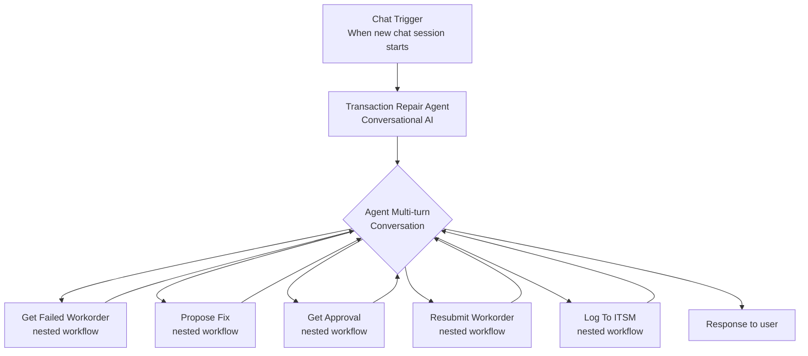

# Transaction Repair Agent

A conversational AI agent that helps operations teams diagnose and repair failed work orders through natural chat interaction. Built with Azure Logic Apps Standard and Azure OpenAI, the agent guides users through work order analysis, proposes fixes, manages approvals, resubmits transactions, and logs all activities to ITSM for audit compliance.

**[Watch Demo Video](https://youtu.be/-V4n9VMcN0k)** | **[Agent Workflow Blog](https://techcommunity.microsoft.com/blog/integrationsonazureblog/%F0%9F%A4%96-agent-loop-demos-%F0%9F%A4%96/4414770)**

---

## Deploy

**Prerequisites:**
- Azure subscription with contributor access
- Region supporting Azure OpenAI (gpt-4o-mini) and Logic Apps Standard - see [region selection](#region-selection)

**Deploy to your Azure subscription:**

[](https://portal.azure.com/#create/Microsoft.Template/uri/https%3A%2F%2Fraw.githubusercontent.com%2Fpetehauge%2Flogicapps-labs%2Fcombined-samples-test%2Fsamples%2Ftransaction-repair-agent%2FDeployment%2Fsample-arm.json)

<details>
<summary><b>What happens when you deploy</b></summary>

1. Opens Azure Portal and prompts for subscription, [resource group](https://learn.microsoft.com/azure/azure-resource-manager/management/manage-resource-groups-portal) (create new recommended: `rg-transactionrepair`)
2. Provisions Azure resources (Logic App, OpenAI, Storage, App Service Plan, Managed Identity)
3. Configures [RBAC (Role-Based Access Control)](https://learn.microsoft.com/azure/role-based-access-control/overview) permissions for passwordless authentication
4. Deploys conversational agent workflows with built-in test data

</details>

<details>
<summary><b>What gets deployed</b></summary>

| Resource | Purpose |
|----------|----------|
| Logic App Standard | Hosts conversational agent workflows |
| Azure OpenAI | gpt-4o-mini model for agent reasoning |
| Storage Account | Workflow state and run history |
| App Service Plan | Compute resources |
| Managed Identity | Passwordless authentication |

See [Deployment automation](#learn-more) and [Sample data approach](#learn-more) for technical details.

</details>

<details id="region-selection">
<summary><b>Region selection</b></summary>

Recommended regions: East US 2, West Europe, Sweden Central, Australia East

See regional availability:
- [Azure OpenAI models](https://learn.microsoft.com/azure/ai-services/openai/concepts/models#model-summary-table-and-region-availability)
- [Logic Apps Standard](https://azure.microsoft.com/explore/global-infrastructure/products-by-region/)

</details>

<details>
<summary><b>Resource naming</b></summary>

Resources use `{projectName}` for subscription-scoped resources and `{projectName}{uniqueId}` for globally-unique resources:

| Resource | Example (projectName = "txrepair") |
|----------|------------------------------------|
| Resource Group | `rg-txrepair` |
| Logic App | `txrepairxyz123-logicapp` |
| Azure OpenAI | `txrepair-openai` |
| Storage Account | `txrepairxyz123` |

</details>

---

## Explore

After deployment, test the conversational agent to see how it guides you through work order repair workflows


### Run a test

1. Open [Azure Portal](https://portal.azure.com) > your resource group > Logic App > **Workflows** > **TransactionRepairAgent**
2. Click **Overview** > **Chat** button to [start a conversation with the agent](https://learn.microsoft.com/azure/logic-apps/create-conversational-agent-workflows#run-and-test-your-conversational-agent)
3. Type or paste one of the test prompts below
4. Watch the agent retrieve work order details, propose fixes, check approvals, and log to ITSM
5. (Optional) Check [**Run history**](https://learn.microsoft.com/azure/logic-apps/monitor-logic-apps#review-runs-history) to see nested workflow calls

**Test these scenarios to see different decision paths:**

<details>
<summary><b>Test scenario 1: Schema validation failure (approved)</b></summary>

Chat prompt:
```
Process work order WO-12345
```

**Expected behavior:**
- Agent retrieves work order (schema_validation_error, $250 amount)
- Proposes fix: Convert amount from string to number, validate schema
- Checks approval → **APPROVED**
- Resubmits corrected work order
- Logs to ITSM (generates incident ID like INC416577)
- Confirms completion and offers help with another work order

**Run history shows:** 5 nested workflow calls (GetWorkOrder → GetFixPlan → GetApproval → ResubmitWorkOrder → LogToITSM)

</details>

<details>
<summary><b>Test scenario 2: Timeout configuration (denied)</b></summary>

Chat prompt:
```
Let's start by retrieving the details of the failed work order WO-67890
```

**Expected behavior:**
- Agent retrieves work order (timeout_config, 30s timeout)
- Proposes fix: Increase timeout to 300s, add retry policy
- Checks approval → **DENIED**
- Skips resubmission (correctly follows denial)
- Logs to ITSM automatically for audit trail
- Confirms completion

**Run history shows:** 4 nested workflow calls (GetWorkOrder → GetFixPlan → GetApproval → LogToITSM, skips ResubmitWorkOrder)

</details>

<details>
<summary><b>Test scenario 3: Missing required field (approved)</b></summary>

Chat prompt:
```
Help me fix work order WO-11111
```

**Expected behavior:**
- Agent retrieves work order (missing_required_field, customerId/productId)
- Proposes fix: Add missing field, apply field mapping
- Checks approval → **APPROVED**
- Resubmits corrected work order
- Logs to ITSM (generates incident ID like INC217995)
- Confirms completion and offers help with another work order

**Run history shows:** 5 nested workflow calls (GetWorkOrder → GetFixPlan → GetApproval → ResubmitWorkOrder → LogToITSM)

</details>

**Tips:**

- Agent is conversational and explains each step
- Agent calls **one tool per turn** (retrieves info, proposes fix, checks approval, etc.)
- Review **Run history** to see nested workflow execution
- Check run details for token usage in **Metadata** tab
- Conversations complete in 15-30 seconds (multiple turns)
- [Learn more about conversational agents](https://learn.microsoft.com/azure/logic-apps/create-conversational-agent-workflows)

---

## Extend

This sample uses **nested workflows with mock data** to eliminate external dependencies. Here's how to extend it for production use:

**Note:** The Chat interface is for testing only. For production scenarios with external users, configure proper authentication. [Learn more about securing conversational agent workflows](https://learn.microsoft.com/azure/logic-apps/create-conversational-agent-workflows?tabs=standard#trigger-or-run-the-workflow).

### Replace demo services

| Component | Demo Implementation | Production Options |
|-----------|----------------------|-------------------|
| Work Order Queue | **GetWorkOrder** nested workflow with mock array (3 work orders) | Azure Service Bus, Cosmos DB, SQL Database, Event Grid, REST APIs |
| Repair Catalog | **GetFixPlan** nested workflow with mock catalog (3 failure types) | Azure App Configuration, Cosmos DB rules engine, AI recommendations, knowledge base |
| Approval System | **GetApproval** nested workflow with mock responses (3 approvals) | Teams Adaptive Cards, Power Automate approvals, ServiceNow, custom approval API |
| Work Order Submission | **ResubmitWorkOrder** nested workflow (simulated) | Azure Service Bus send, REST API POST, ERP integration, queue writers |
| ITSM Logging | **LogToITSM** nested workflow (generates incident IDs) | ServiceNow REST API, Azure Monitor, Application Insights, Jira, custom webhook |

### Customize workflows

**Option 1: Edit in Azure Portal**
- Navigate to your Logic App > Workflows > select workflow > **Edit**
- Use the visual designer to modify workflow logic
- [Learn more about editing workflows in Azure Portal](https://learn.microsoft.com/azure/logic-apps/create-single-tenant-workflows-azure-portal)

**Option 2: Edit in VS Code**
- Install [Azure Logic Apps (Standard) extension](https://marketplace.visualstudio.com/items?itemName=ms-azuretools.vscode-azurelogicapps)
- In VS Code, select the Azure icon on the Activity Bar
- Under **Resources**, expand your subscription and find your deployed Logic App
- Expand **Workflows**, right-click a workflow, and select **Open Designer** to view/edit
- [Learn more about editing workflows in VS Code](https://learn.microsoft.com/azure/logic-apps/manage-logic-apps-visual-studio-code)

### Integrate with external systems

Replace nested workflow mock data with real connectors:

**For GetWorkOrder (Work Order Queue):**
- Add [Azure Service Bus connector](https://learn.microsoft.com/azure/connectors/connectors-create-api-servicebus) to receive messages from queue
- Or use [Cosmos DB connector](https://learn.microsoft.com/azure/connectors/connectors-create-api-cosmos-db) to query work order database

**For GetApproval (Approval System):**
- Add [Microsoft Teams connector](https://learn.microsoft.com/azure/connectors/connectors-create-api-teams) with Adaptive Cards for human approval
- Or use [HTTP connector](https://learn.microsoft.com/azure/connectors/connectors-native-http) to call custom approval API

**For LogToITSM (ITSM Logging):**
- Add [ServiceNow connector](https://learn.microsoft.com/azure/connectors/connectors-create-api-servicenow) to create incident records
- Or use [HTTP connector](https://learn.microsoft.com/azure/connectors/connectors-native-http) to call custom ITSM webhook

**For ResubmitWorkOrder (Work Order Submission):**
- Add [Azure Service Bus connector](https://learn.microsoft.com/azure/connectors/connectors-create-api-servicebus) to send corrected work order to queue
- Or use [HTTP connector](https://learn.microsoft.com/azure/connectors/connectors-native-http) to POST to processing API

---

## Workflows

Six workflows process work order repairs using conversational AI interaction:

<details>
<summary><b>Workflow details</b></summary>

### TransactionRepairAgent

Conversational agent that guides users through work order repair workflows. The agent analyzes failed work orders, proposes fixes, manages approvals, resubmits transactions, and logs all activities to ITSM for audit compliance.

**Agent Tools (Nested Workflows):**
- **Get_failed_workorder** - Retrieves failed work order details by tracking ID (calls GetWorkOrder workflow)
- **Propose_fix** - Analyzes failure type and proposes repair steps (calls GetFixPlan workflow)
- **Get_approval** - Checks if repair requires approval and retrieves decision (calls GetApproval workflow)
- **Resubmit_workorder** - Resubmits corrected work order to processing queue (calls ResubmitWorkOrder workflow)
- **Log_to_itsm** - Generates ITSM incident for audit trail (calls LogToITSM workflow)

**Process Flow:**



### GetWorkOrder

Retrieves failed work order details by tracking ID. Uses Query action to find matching work order from mock data array.

**Mock Data:** 3 work orders (WO-12345, WO-67890, WO-11111) with different failure types

### GetFixPlan

Analyzes failure type and returns repair steps from catalog. Looks up fix plan based on failure reason.

**Mock Data:** Repair catalog with 3 failure types (schema_validation_error, timeout_config, missing_required_field)

### GetApproval

Checks approval status for repair request. Returns approval decision based on tracking ID.

**Mock Data:** 3 approval responses (WO-12345: APPROVED, WO-67890: DENIED, WO-11111: APPROVED)

### ResubmitWorkOrder

Resubmits corrected work order to processing queue. Returns confirmation with tracking ID and timestamp.

**Mock Data:** Simulated resubmission (returns status "resubmitted")

### LogToITSM

Generates ITSM incident record for audit trail. Returns incident ID with tracking information.

**Mock Data:** Generates random incident IDs (INC######)

</details>

<details>
<summary><b>Required Connections</b></summary>

This sample uses Azure OpenAI with Managed Identity authentication for passwordless access.

| Connection Name | Connector Name | Connector Type | Purpose |
|-----------------|----------------|----------------|---------|
| Azure OpenAI Connection | Azure OpenAI | Agent | Powers the conversational AI agent in TransactionRepairAgent workflow |

**Authentication:** System-Assigned Managed Identity with `Cognitive Services OpenAI User` role assigned to Azure OpenAI resource during deployment.

</details>

---

## Learn More

<details>
<summary><b>Troubleshooting</b></summary>

| Issue | Solution |
|-------|----------|
| **CustomDomainInUse** | Use different project name. [Purge deleted resources](https://learn.microsoft.com/azure/ai-services/recover-purge-resources) if needed. |
| **InsufficientQuota** | Try different [region](#region-selection) or [request quota increase](https://learn.microsoft.com/azure/ai-services/openai/how-to/quota). |
| **Deployment timeout** | Allow 15 min. [View Activity Log](https://learn.microsoft.com/azure/azure-monitor/essentials/activity-log). Redeploy: resource group > Deployments > select > Redeploy. |
| **Unauthorized** | Wait 2-3 min for RBAC propagation. [Verify role assignments](https://learn.microsoft.com/azure/logic-apps/authenticate-with-managed-identity?tabs=standard). |
| **ajaxExtended call failed** | Designer: rename trigger → save → rename back > save. [Details](https://learn.microsoft.com/answers/questions/2046895). |
| **No Chat button** | Verify TransactionRepairAgent workflow `kind` is `"Agent"` and trigger `kind` is `"Agent"`. |
| **Chat not responding** | Wait 1-2 min, refresh. Check run history for errors. Verify OpenAI model is active. |
| **Nested workflow error** | Verify all nested workflows have Response actions at workflow level with statusCode 200. |

</details>

<details>
<summary><b>Deployment automation</b></summary>

The Deploy to Azure button uses a two-stage process:

**Build** (manual via [`BundleAssets.ps1`](../shared/scripts/BundleAssets.ps1)):
- Compiles [Bicep modules](../shared/modules/) → [`sample-arm.json`](Deployment/sample-arm.json)
- Bundles [workflow definitions](LogicApps/) → [`workflows.zip`](Deployment/workflows.zip)

**Deploy** (automated):
- [ARM (Azure Resource Manager)](https://learn.microsoft.com/azure/azure-resource-manager/templates/overview) template provisions Azure resources
- Embedded deployment script configures RBAC and deploys workflows

[Learn about ARM deployment scripts](https://learn.microsoft.com/azure/azure-resource-manager/bicep/deployment-script-bicep)

</details>

<details>
<summary><b>Sample data approach</b></summary>

This sample uses nested workflows with mock data to simplify exploration:
- **Work orders:** GetWorkOrder workflow (3 mock work orders)
- **Repair catalog:** GetFixPlan workflow (3 failure types)
- **Approval system:** GetApproval workflow (predetermined decisions)
- **ITSM logging:** LogToITSM workflow (generated incident IDs)

**Note:** The Chat interface is for testing only. For production use with external users, configure proper authentication. [Learn more](https://learn.microsoft.com/azure/logic-apps/create-conversational-agent-workflows?tabs=standard#trigger-or-run-the-workflow).

For production integration options, see [Extend](#extend).

</details>

<details>
<summary><b>Architecture decisions</b></summary>

**Why nested workflows?**
- Demonstrates agent tool pattern with callable workflows
- Each tool is independently testable
- Clear separation of concerns (retrieval, analysis, actions)
- Easy to extend with real connectors
- Reusable workflows across multiple agents

**Why conversational agent (not autonomous)?**
- Human-in-the-loop for work order decisions
- Operations teams prefer guided workflows
- Natural language interaction for diagnostics
- Multi-turn conversation pattern
- First conversational agent sample in repository

**Why deterministic mock data?**
- Reproducible test results
- No external dependencies to configure
- Clear demonstration of approval workflows
- Easy to extend to Teams/ServiceNow/etc.

</details>

<details>
<summary><b>Resources</b></summary>

**Agent workflows:** [Create conversational agents](https://learn.microsoft.com/azure/logic-apps/create-conversational-agent-workflows) | [Create autonomous agents](https://learn.microsoft.com/azure/logic-apps/create-autonomous-agent-workflows) | [Best practices](https://learn.microsoft.com/azure/logic-apps/create-autonomous-agent-workflows#best-practices-for-agents-and-tools)

**Azure OpenAI:** [System messages](https://learn.microsoft.com/azure/ai-services/openai/concepts/system-message) | [Managed Identity](https://learn.microsoft.com/azure/logic-apps/authenticate-with-managed-identity)

</details>
